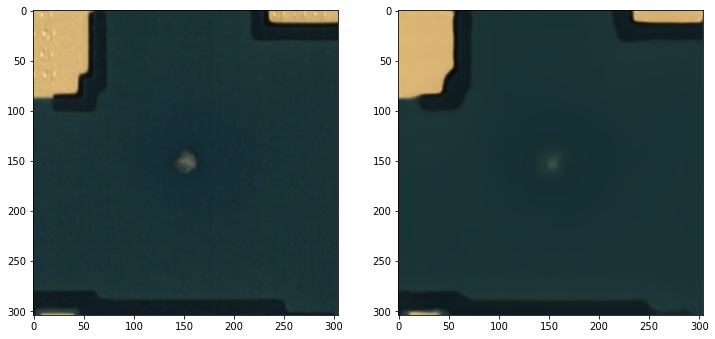
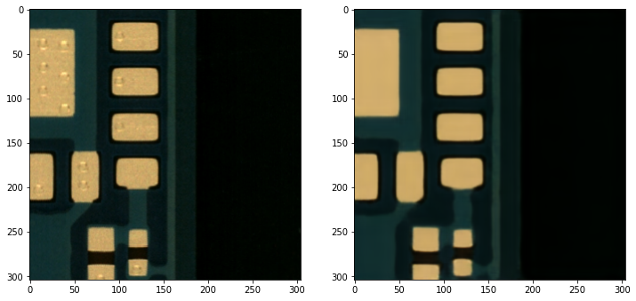

# PCB_Anomaly_Detection
Detecting and classifying the Anomaies in printed circuit board (PCB).
It Improves the performance of the PCB false alarm system by improving the F1 score using the various Deep Learning and Computer Vision methods.

Models which are used here for expermient-
  1. Base CNN
  2. Inception V3
  3. ResNet 50
  4. U-Net
  5. Convolutional Autoencoder
  
 ## Base CNN: 
 used 7 layer CNN channel with 2 dense layer at the end with hyperparameter tuning. got the F1 score of 0.85
 
 ## Inception V3: 
 Trained and done the hyperparameter tuning and Got the F1 score of 0.82
 
 ## ResNet 50: 
 Trained and changed modified model architecture along with hyperparameter tuning and Got the F1 score of 0.837
 
 ## U-Net: 
 It has 4 layer encoder and 4 layer decoder and Trained it with hyperparameter tuning and Got the Dice score of 0.66
 
 ## Convolutional Autoencoder: 
    1. It has 4 layer encoder and 4 layer decoder and Trained it with hyperparameter tuning and Got the F1 score of 0.8
    2. changed the model structure on latent side in the middle by adding a network and trained it and got the F1 score of 0.94
    
 Defect_Image_Reconstruction-
 
 
 False_Image_Reconstruction-
 
    
    

 
 

  
